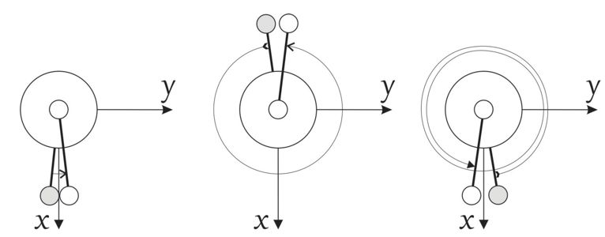

Frames and vibrational coordinates
**********************************

Here we introduce different ingredients available for triatomic molecules, including

- Molecular frames :math:`xyz`;
- :math:`3N-6` (:math:`3N-5`) vibrational coordinates :math:`\xi_n`;

For the linearised coordinates, the default frame is Eckart. The equilibrium structures, required for the definition of the linearised KEO and PEF, are chosen as the principal axis system (PAS). For the curvilinear KEOs, the frames are defined by the construction of the KEOs in their analytic representations.

Triatomics
==========

XY\ :sub:`2` type molecules
---------------------------

.. sidebar::

    .. figure:: img/XY2.jpg
       :alt: XY2 equilibrium structure

       An XY\ :sub:`2`  type molecule and the bisector embedding.

A molecule type is defined by the keyword ``MolType``. For the XY\ :sub:`2`  example it is
::

       MolType XY2

in the curvilinear KEO,  it is common in TROVE to use the bisector frame for the XY\ :sub:`2` molecules, with the :math:`x` axis bisecting the bond angle and the :math:`z` in the plane of the molecule, but other embeddings are possible. The PAS frame coincides with the bisector frame at the equilibrium or non-rigid reference configuration (i.e. symmetric).  In TROVE, the definition of the frame is combined with the definition of the internal coordinates via the keyword ``transform``. In the following, these are described.

There are currently at least two  exact, curvilinear KEO forms are provided for a quasi-linear XY\ :sub:`2` molecules, ``KINETIC_XY2_EKE_BISECT``, ``KINETIC_XY2_EKE_BISECT_SINRHO``, see below.

``R-RHO-Z``
^^^^^^^^^^^

- ``R-RHO-Z`` is used for (quasi-)linear molecules of the XY\ :sub:`2` type. it defined the curvilinear vibrational coordinates as the two bond angles :math:`r_1` and :math:`r_2` with  the bending mode described by the angle :math:`\rho = \pi - \alpha`, where :math:`\alpha` is the interbond angle (:math:`\rho = 0 \ldots \rho_{\rm max}`). For the rigid reference frame (``REFER-CONF RIGID``), the actual internal coordinates are the displacements of :math:`r_1`, :math:`r_2` and :math:`\rho` from the corresponding equilibrium:

.. math::

    \begin{split}
    \xi_1 &= r_1 - r_{\rm e}, \\
    \xi_2 &= r_2 - r_{\rm e}, \\
    \xi_3 &= \rho,
    \end{split}

where :math:`r_{\rm e}` is the equilibrium bond length. If the non-rigid reference frame is used (``REFER-CONF NON-RIGID``), the bending mode is given on an equidistant grid, typically of 1000-2000 points, while the stretching modes are the displacements from the given :math:`\rho` point along the non-rigid reference frame, the latter is usually defined as the principal axes system with the bond length fixed to the equilibrium:

.. math::

    \begin{split}
    \xi_1 &= r_1 - r_{\rm ref}, \\
    \xi_2 &= r_2 - r_{\rm ref}, \\
    \xi_3 &= \rho,
    \end{split}

TROVE uses Z-matrix coordinates to build any user-defined coordinates. In this case, the Z=matrix is given by
::

     ZMAT
         S   0  0  0  0  31.97207070
         H   1  0  0  0   1.00782505
         H   1  2  0  0   1.00782505
     end

Alternatively, the reference value of the bond length :math:`r_{\rm ref}` can also vary with :math:`\rho` as e.g. in the minimum energy path (MEP) definition with :math:`r_{\rm ref}` being the optimised value at the given value of :math:`\rho` corresponding to the local energy minimum. In this case, the non-rigid frame must be defined using the ``MEP`` block (see the corresponding section).

For the linearised coordinates type (``COORDS Linear``), the actual internal coordinates are the linearised versions of :math:`\xi_i` above. More specifically, for the ``non-rigid`` reference configuration, the bending coordinate :math`\rho` is kept curvilinear on a grid of :math`\rho_k` points as before, while the stretching coordinates are defined by linearly expanding :math`r_1` and :math`r_2` in terms of the Cartesian displacement around the corresponding reference values :math:`r_{\rm ref}`. In the ``Rigid`` case, the bending coordinate is also linearised.

The advantage of the linearised coordinates is that the corresponding KEO can be constructed on the fly as part of the TROVE generalised procedure as a Taylor type expansion. The main disadvantage however is that the approximate linearised KEO operator is less accurate than the (exact) curvilinear EKO. Besides, the convergence of the variational solution is also poorer for the linearised case (see [15YaYu]_).

``R-RHO-Z-ECKART``
^^^^^^^^^^^^^^^^^^

This ``Transform`` type is very similar to ``R-RHO-Z``, but with the molecular frame define using the Eckart conditions.

``R-ALPHA-Z``
^^^^^^^^^^^^^

- ``R-ALPHA-Z`` is very similar to ``R-RHO-Z`` with the difference in the bending coordinate, which in the interbond angle :math:`\alpha` in this case. In the ``Rigid`` reference configuration, it is a displacement from the equilibrium value :math:`\alpha_{\rm e}`:
.. math::

    \begin{split}
    \xi_1 &= r_1 - r_{\rm e}, \\
    \xi_2 &= r_2 - r_{\rm e},\\
    \xi_3 &= \alpha-\alpha_{\rm e}.
    \end{split}

In the ``Non-rigid`` reference configuration, :math:`\alpha` is given on a grid of points ranging from :math:`\alpha_{\rm min}` to :math:`\alpha_{\rm max}` and including the equilibrium value. In the linearised ``Rigid`` case, the bending coordinated is defined as a linear expansion of :math:`\alpha` at :math:`\alpha_{\rm eq}`  in terms of the Cartesian displacements.

TROVE input example:
::
  
  COORDS       local    (curvilinear coordinates)
  TRANSFORM    r-rho-z  (r1, r2, rho with the x parallel to the bisector)
  MOLTYPE      XY2
  REFER-CONF   non-RIGID  (Reference configuration)
  
.. Note:: The text in brackets is used for comments.

R-RHO-Z-M2-M3
^^^^^^^^^^^^^

A 'bisecting' XY\ :sub:`2` frame used for isotopologies with slightly different masses of Y\ :sub:`1` and Y\ :sub:`2`, for example O\ :sup:`16`\ CO\ :sup:`17`.
Although this is an XYZ molecule, in this case it is formally treated as XY\ :sub:`2 but with non-symmetric masses and the Cs symmetry, e.g.:
::

     TRANSFORM    R-RHO-Z-M2-M3
     MOLTYPE      XY2
     MOLECULE     CO2
     REFER-CONF   non-RIGID

     SYMGROUP Cs(M)

     ZMAT
         C   0  0  0  0   11.996709
         O   1  0  0  0   16.995245
         O   1  2  0  0   15.9905256
     end

XYZ type molecules
------------------

.. sidebar::

    .. figure:: img/XYZ.jpg
       :alt: XYZ equilibrium structure

       An XYZ type molecule and the :math:`z`  embedding.

The main embedding here is the 'bond'-embedding, with the :math:`z` axis placed parallel to the bond Y-Z with a heavier atom Z comparing to X (second bond).
For molecules XYZ with  comparable masses X and Z (e.g. in similar isotopologues), the bisector frames and associated ``TRANSFORM`` can be used.

``R1-Z-R2-RHO``
^^^^^^^^^^^^^^^^^

This is a 'bond'-embedding with the same vibrational coordinates as in ``R-RHO-Z`` and :math:`r_1` along the :math:`z` axis. The coordinates are givem as above:

.. math::

    \begin{split}
    \xi_1 &= r_1 - r_{\rm e}, \\
    \xi_2 &= r_2 - r_{\rm e}, \\
    \xi_3 &= \rho,
    \end{split}

Here is an example of the Z-matrix for NNO.
::

     ZMAT
         N   0  0  0  0   14.00307401
         N   1  0  0  0   14.00307401
         O   1  2  0  0   15.994915
     end

``R1-Z-R2-ALPHA``
^^^^^^^^^^^^^^^^^

This is another 'bond'-embedding with the same vibrational coordinates as in ``R-ALPHA-Z``.

Tetratomics
===========

XY\ :sub:`3` rigid  molecules (PH\ :sub:`3` type)
-------------------------------------------------

Linearized KEOs use the Eckart frame with the PAS at the equilibrium configuration. The latter has the :math:`z` axis along the axis of symmetry :math:`C_3` with the :math:`x` axis chosen in plane containing the X-Y\ :sub:`1` bond and passing through :math:`C_3`.

``R-ALPHA``
^^^^^^^^^^^

For the rigid XY\ :sub:`3`, like PH\ :sub:`3`, the logical coordinate choice of the valence coordinates consists of three bond lengths :math:`r_1`, :math:`r_2`, :math:`r_3`, :math:`\alpha_{23}`, :math:`\alpha_{13}` and :math:`\alpha_{12}`. For the linearised KEO, these valence are used to form the linearised coordinates in the same way as before (1st order expansion in terms of the Cartesian displacement). For the curvilinear KEO (``local``), the vibrational coordinates are then defined as displacement from the corresponding equilibrium (or non-rigid reference) values:

.. math::
    \begin{split}
    \xi_1 &= r_1 - r_{\rm e}, \\
    \xi_2 &= r_2 - r_{\rm e}, \\
    \xi_3 &= r_3 - r_{\rm e}, \\
    \xi_4 &= \alpha_{23}-\alpha_{\rm e}, \\
    \xi_5 &= \alpha_{13}-\alpha_{\rm e}, \\
    \xi_6 &= \alpha_{12}-\alpha_{\rm e}.
    \end{split}

.. sidebar::

    .. figure:: img/PH3.jpg
       :alt: PH3 equilibrium structure

       PH\ :sub:`3` equilibrium structure

The underlying Z-matrix coordinates are defined using the following Z-matrix:
::

      ZMAT
          N   0  0  0  0  14.00307401
          H   1  0  0  0   1.00782505
          H   1  2  0  0   1.00782505
          H   1  2  3  1   1.00782505
      end

This representation has been used for PH\ :sub:`3` [15SoAlTe]_, SbH\ :sub:`3` [10YuCaYa]_, AsH\ :sub:`3` [19CoYuKo]_, PF\ :sub:`3` [19MaChYa]_.

XY\ :sub:`3` non-rigid with umbrella motion (NH\ :sub:`3` type)
---------------------------------------------------------------

::

       MolType XY3

Consider the Ammonia molecule NH3\ :sub:`3` with a relatively small barrier to the planarity. The three bending angles are not suitable in this case  as they cannot distinguish the two opposite inversion configurations above and below the planarity. Instead, an umbrella mode has to be introduced as one of the bending modes. An example of an umbrella coordinate is an angle between the :math:`C_3` symmetry axis and the bond X-Y, see Figure. It is natural to use the non-rigid reference configuration along the umbrella, inversion motion and build the KEO as an expansion around it. For two other bending modes, in principle one can use two inter-bond angles, e.g.  :math:`\alpha_2` and :math:`\alpha_3`, two dihedral angles :math:`\phi_2` and :math:`\phi_3`. However, for symmetry reasons, TROVE employs the symmetry-adapted bending pair :math:`S_a` and :math:`S_b`, defined as follows:

.. math::

    S_a = \frac{1}{\sqrt{6}} (2 \alpha_{23}-\alpha_{13}-\alpha_{12}), \\
    S_b  = \frac{1}{\sqrt{2}} ( \alpha_{13}-\alpha_{12})

or

.. math::

    S_a = \frac{1}{\sqrt{6}} (2 \phi_{23}-\phi_{13}-\phi_{12}), \\
    S_b  = \frac{1}{\sqrt{2}} ( \phi_{13}-\phi_{12})

The umbrella mode for any instantaneous configuration of the nuclei is defined in TROVE as the angle between a trisector

.. sidebar::

   .. figure:: img/umbrella.jpg
       :alt: Umbrella motions

       NH\ :sub:`3`: umbrella modes :math:`\rho` and :math:`\delta`.

Linearized KEOs use the Eckart frame with the PAS at the equilibrium configuration. The latter has the :math:`z` axis along the axis of symmetry :math:`C_3` with the :math:`x` axis chosen in plane containing the X-Y\ :sub:`1` bond and passing through :math:`C_3`.

``R-S-DELTA``
^^^^^^^^^^^^^

For this ``TRANSFORM`` case, the following valence-based coordinates are used:

.. math::

    \begin{split}
    \xi_1 &= r_1 - r_{\rm e}, \\
    \xi_2 &= r_2 - r_{\rm e}, \\
    \xi_3 &= r_3 - r_{\rm e}, \\
    \xi_4 &= \frac{1}{\sqrt{6}} (2 \alpha_{23}-\alpha_{13}-\alpha_{12}),  \\
    \xi_5 &= \frac{1}{\sqrt{2}} ( \alpha_{13}-\alpha_{12}),  \\
    \xi_6 &= \delta.
    \end{split}

The umbrella mode :math:``\delta`` is defined as an angle between the trisector and any of the bonds X-Y. The other 5 coordinates are then used to construct the corresponding linearised vibrational coordinates (see above) for the linearised (``linear``) representation.

ZXY\ :sub:`2` (Formaldehyde type)
---------------------------------

::

       MolType ZXY2

The common valence coordinate choice for ZXY\ :sub:`2` includes three bond lengths , two bond angles and a dihedral angle :math:`\tau`. The latter can be treated as the reference for a non-rigid reference configuration in TROVE on a grid of :math:`\tau_i` ranging from  :math`[-\tau_{0}\ldots \tau_{0}]`, while other 5 modes are treated as displacement from their equilibrium values at each grid point :math:`\tau_i`. The reference configuration is always in the principle axis sysetm, i.e. for each value of the book angle :math:`\tau`, TROVE solve the PAS conditions to reorient the molecule.

.. sidebar::

   .. figure:: img/H2CO.jpg
       :alt: H2CO

       Valence coordinates and the bisector frame used for H\ :sub:`2`\ CO.

 Apart from the standard linearised KEO, a curvilinear exact KEO has been recently introduced into TROVE. This is exactly the ``R-THETA-TAU`` type, detailed below.

``R-THETA-TAU``
^^^^^^^^^^^^^^^

.. math::

    \begin{split}
    \xi_1 &= r_1 - r_{\rm e}, \\
    \xi_2 &= r_2 - r_{\rm e}, \\
    \xi_3 &= r_3 - r_{\rm e}, \\
    \xi_4 &= \theta_1,  \\
    \xi_5 &= \theta_2,  \\
    \xi_6 &= \tau.
    \end{split}

Isotopologues of XY\ :sub:`3`  as ZXY\ :sub:`2` type
----------------------------------------------------

The Z type can be used to define signle or double deturated isotopologues of an XY\ :sub:`3` molecule such as a rigid PH\ :sub:`3` or non-rigid NH\ :sub:`3`. For PDH\ :sub:`2`, we use ``R-THETA-TAU`` in combination with the Z-matrix given as follows:
::

      ZMAT
          P   0  0  0  0  14.00307401
          D   1  0  0  0   2.01410178
          H   1  2  0  0   1.007825032
          H   1  2  3  2   1.007825032
      end

Here, the equilibrium frame coinsides with the principle axis system with the :math:`z` axis in the plane conteining PD and bisetcing the angle betwen two PH bonds.

For a  PH\ :sub:`2`D type isotopologue, the Z-matrix is given by

      ZMAT
          P   0  0  0  0  14.00307401
          H   1  0  0  0   1.007825032
          D   1  2  0  0   2.01410178
          D   1  2  3  2   2.01410178
      end

ZXY\ :sub:`3` (Methyl Chloride type)
------------------------------------
::

       MolType ZXY3

Similarilly, for the ZXY\ :sub:`3` type molecule we use valence coordinates consisting of four bond lengths :math:`r_0`, :math:`r_i` (:math:`i-1,2,3`), three bond angles :math:`\beta_i` and two symmetry adapted dihedral coordinates constructed from three dihedral angles :math:`\tau_{12}, \tau_{23}, \tau_{13}`, where :math:`\tau_{12}+\tau_{23}+\tau_{13} = \pi`. This is a ``rigid`` type, where all coordinates are treated as displacements from the corresponding equilibrium values. Currently, only the standard linearised KEO is available in TROVE.

.. sidebar::

   .. figure:: img/CH3Cl.jpg
       :alt: CH3Cl

       Valence coordinates and the bisector frame used for CH\ :sub:`3`\ Cl.

``R-BETA-SYM``
^^^^^^^^^^^^^^

.. math::

    \begin{split}
    \xi_1 &= r_0 - r_{\rm e}^{(0)}, \\
    \xi_2 &= r_1 - r_{\rm e}, \\
    \xi_3 &= r_2 - r_{\rm e}, \\
    \xi_4 &= r_3 - r_{\rm e}, \\
    \xi_5 &= \beta_1-\beta_{\rm e},  \\
    \xi_6 &= \beta_2-\beta_{\rm e},  \\
    \xi_7 &= \beta_3-\beta_{\rm e},  \\
    \xi_8 &= \frac{1}{\sqrt{6}} (2 \tau_{23}-\tau_{13}-\tau_{12}),  \\
    \xi_9 &= \frac{1}{\sqrt{2}} ( \tau_{13}-\tau_{12}).  \\
    \end{split}

The Z-matrix coordinates (underlying basic TROVE coordinates) are as given by the Z-matrix rules:
::

     ZMAT
         C   0  0  0  0  12.000000000
         Cl  1  0  0  0  34.968852721
         H   1  2  0  0   1.007825035
         H   1  2  3  0   1.007825035
         H   1  2  3  4   1.007825035
     end

are as follows:

- :math:`r_0`
- :math:`r_1`, :math:`\beta_{1}`
- :math:`r_2`, :math:`\beta_{2}`, :math:`\alpha_{12}`
- :math:`r_3`, :math:`\beta_{3}`, :math:`\alpha_{13}`

where \alpha_{12}` and :math:`\alpha_{13}` are interbond angles between the bonds X-Y\ :sub:`i`.  The Z-matrix coordinates are transformed
to :math:`\tau_{12}, \tau_{23}, \tau_{13} ` via the following trigonometric rules:

.. math::

    \begin{split}
    \cos \tau_{12} &= \frac{\cos\alpha_{12}-\cos\beta_{1}\cos\beta_{2}}{\sin\beta_{1}\sin\beta_{2}}, \\
    \cos \tau_{13} &= \frac{\cos\alpha_{13}-\cos\beta_{1}\cos\beta_{3}}{\sin\beta_{1}\sin\beta_{3}}, \\
    \tau_{23} &= 2\pi - \tau_{12}-\tau_{13},\\
    \cos \alpha_{23} &= \cos\beta_{2}\cos\beta_{3}+\cos(\tau_{12}+\tau_{13})\sin\beta_{2}\sin\beta_{3}.\\
    \end{split}

A chain ABCD type molecule  (hydrogen peroxide type)
----------------------------------------------------
::

       MolType ABCD

``R-ALPHA-TAU``
^^^^^^^^^^^^^^

The six internal coordinates for the ``Transform R-ALPHA-TAU`` type consist of three stretching, two bending and one dihedral coordinates as given by

.. sidebar::

   .. figure:: img/A2B2.jpg
       :alt: A2B2

       Valence coordinates used for HOOH.

.. math::

    \begin{split}
    \xi_1 &= R - R_{\rm e}, \\
    \xi_2 &= r_1 - r_{\rm e}, \\
    \xi_3 &= r_2 - r_{\rm e}, \\
    \xi_4 &= \alpha_{123}-\alpha_{\rm e},  \\
    \xi_5 &= \alpha_{234}-\alpha_{\rm e},  \\
    \xi_6 &= \delta.
    \end{split}

The non-rigid reference frame such that the :math:`x` axis bisects the dihedral angle.

.. sidebar::

   .. figure:: img/H2O2-bisector.jpg
       :alt: H2O2-bisector

       Molecular frame used for HOOH: the :math:`x` axis  always bisecting the dihedral angle :math:`\delta` .

For this embedding, in order to be able to separate the vibrational and rotational bases into a product form, it is important to the an extended range for the dihedral angle :math:`\delta = 0\ldots 720^\circ`. Otherwise the eigenfunction is obtained double valued due to the  :math:`x` axis appearing in the opposite direction to the two bonds after one :math:`\delta = 360^\circ` revolution.

   Principal axis system with an extended torsional angle :math:`\delta = 0\ldots 720^\circ` for HOOH.

A minimum energy path  (MEP) as a non-rigid reference configuration
-------------------------------------------------------------------

In MEP, the 5 internal coordinate displacements :math:`\xi_i` are defined around :math:`\delta`-dependent reference values. The latter are obtained as oprmised geometries by minimised molecule's energy:

.. math::

    \begin{split}
    \xi_1 &= R - R_{\rm ref}(\delta), \\
    \xi_2 &= r_1 - r_{\rm ref}(\delta), \\
    \xi_3 &= r_2 - r_{\rm ref}(\delta), \\
    \xi_4 &= \alpha_{123}-\alpha_{\rm ref}(\delta),  \\
    \xi_5 &= \alpha_{234}-\alpha_{\rm ref}(\delta),  \\
    \xi_6 &= \delta,
    \end{split}

where :math: the MEP values are given by a parameterised expansion, for example

.. math::

    \zeta_i^{\rm ref} = \zeta_i^{\rm e} + \sum_{n} a_i^n (\cos\delta - \cos\delta_{\rm e})

where :math:`{\bf\zeta} = \{R,r_1,r_2,\alpha_{123},\alpha_{234}\}`.

Fuive-atomic molecules
======================

The XY\ :sub:`4` molecule (T\ :sub:`d`\ ) and the ``XY4`` type
--------------------------------------------------------------
::

       MolType XY4

The frame for the tetrahedral molecule XY\ :sub:`4` spanning the T\ :sub:`d`\ (M) symmetry group is chosen with the :math:`xyz` axes orthogonal to the faces of the box containing the molecule with the four atoms :math:`{\rm Y}_i` at its vertices, as shown in the figure,
with the Cartesian coordinates at equilibrium given by

.. math::

   \begin{split}
      H_{1x} &= -\frac{r_{\rm e}}{\sqrt{3}},  H_{1y}  =  \frac{r_{\rm e}}{\sqrt{3}},  H_{1z} =  \frac{r_{\rm e}}{\sqrt{3}}, \\
      H_{2x} &= -\frac{r_{\rm e}}{\sqrt{3}},  H_{2y}  = -\frac{r_{\rm e}}{\sqrt{3}},  H_{2z} = -\frac{r_{\rm e}}{\sqrt{3}}, \\
      H_{3x} &=  \frac{r_{\rm e}}{\sqrt{3}},  H_{3y}  =  \frac{r_{\rm e}}{\sqrt{3}},  H_{3z} = -\frac{r_{\rm e}}{\sqrt{3}}, \\
      H_{4x} &=  \frac{r_{\rm e}}{\sqrt{3}},  H_{4y}  = -\frac{r_{\rm e}}{\sqrt{3}},  H_{4z} =  \frac{r_{\rm e}}{\sqrt{3}}. \\
   \end{split}

.. sidebar::

   .. figure:: img/XY4.jpg
       :alt: XY4

       The structure and molecular frame of the XY\ :sub:`4` molecule.

``R-ALPHA``
^^^^^^^^^^^

The tetrahedral five-atomic molecule XY\ :sub:`4`  has 9 vibrational degrees of freedom. For a semi-rigid molecule (i.e. ignoring any isomerisation that can occur at higher energies), they can be characterised by four bond lengths :math:`r_i \equiv r_{{\rm C}-{\rm H}_i}` and six inter-bond angles :math:`\alpha_{{\rm H}_i-{\rm C}-{\rm H}_j} = \alpha_{ij}`.  For the equilibrium value of the tetrahedral angle :math:`\alpha`,  :math:`\cos(\alpha_{\rm e})` =  :math:`-1/\sqrt{3}` which explains the factor :math:`1/\sqrt{3}` in the definition of the  Cartesian coordinates.
There should, however, be only 9 independent vibrational degrees of freedom in a 5 atomic molecule. One of the inter-bond angles :math:`\alpha_{ij}` is redundant as there should be only five independent bending vibrations, with the following redundancy condition:

.. math::
     :label: e-redund

      \left| \begin{array}{cccc}
       1               & \cos\alpha_{12} &  \cos\alpha_{13} &  \cos\alpha_{14} \\
       \cos\alpha_{12} & 1               &  \cos\alpha_{23} &  \cos\alpha_{24} \\
        \cos\alpha_{13} & \cos\alpha_{23} & 1                &  \cos\alpha_{34} \\
       \cos\alpha_{14} & \cos\alpha_{24} & \cos\alpha_{34}   &        1
       \end{array}
      \right| = 0 .

XY\ :sub:`4`  belongs to the T\ :sub:`d`\ (M) molecular symmetry group, which consists of five irreducible representations, :math:`A_1`, :math:`A_2`, :math:`E`, :math:`F_1` and :math:`F_2`. One way to define independent bending modes is to reduce the six inter-bond angles :math:`\alpha_{ij}` to five symmetry-adapted  irreducible combinations,  which, together with four bond lengths :math:`r_i` form nine independent vibrational modes :math:`\xi_i` as follows:  four stretches

.. math::
   :label: e-vects-i

    \xi_i  =r_i, \;\; i = 1,2,3,4,

two :math:`E`-symmetry bends

.. math::
    :label:  e-vects-5-6

    \begin{split}
       \xi_5^{E_a}   &= \frac{1}{\sqrt{12}} (2 \alpha_{12} - \alpha_{13} - \alpha_{14} - \alpha_{23} - \alpha_{24} + 2 \alpha_{34} ), \\
       \xi_6^{E_b}  &= \frac{1}{2} (\alpha_{13} - \alpha_{14} - \alpha_{23} + \alpha_{24} ),
    \end{split}

and three :math:`F`-symmetry bends

.. math::
   :label: e-vects-7-9

     \begin{split}
       \xi_7^{F_{2x}}  &= \frac{1}{\sqrt{2}} ( \alpha_{24} - \alpha_{13} ),  \\
       \xi_8^{F_{2y}}  &= \frac{1}{\sqrt{2}} ( \alpha_{23} - \alpha_{14} ), \\
       \xi_9^{F_{2z}}  &= \frac{1}{\sqrt{2}} ( \alpha_{34} - \alpha_{12} ),
      \end{split}

where the corresponding symmetries of the bending modes are indicated.

The stretching modes :math:`r_i` can also be in principle combined into symmetry-adapted coordinates in T\ :sub:`d`\ (M):

.. math::
    :label: e-CH4-xi1=4

     \begin{split}
       \xi_1^{A_1}  &= \frac{1}{2} \left(  r_1 + r_2 + r_3 + r_4\right), \\
       \xi_2^{F_{2x}}  &= \frac{1}{2} \left(  r_1 - r_2 + r_3 - r_4\right), \\
       \xi_3^{F_{2y}}  &= \frac{1}{2} \left(  r_1 - r_2 - r_3 + r_4\right), \\
       \xi_4^{F_{2z}}  &= \frac{1}{2} \left(  r_1 + r_2 - r_3 - r_4\right).
     \end{split}

Six-atomic molecules
====================

The C\ :sub:`2`\ H:sub:`4` molecule and the ``C2H4`` type
---------------------------------------------------------
::

       MolType C2H4

``C2H4_2BETA_1TAU``
^^^^^^^^^^^^^^^^^^^

The internal coordinates are defined using the following 12 valence coordinates: 5 stretching (molecular bond) coordinates, 4 bending (inter-bond angles) and 3 dihedral coordinates, with the last mode as a book angle describing the relative motion of two moieties:

.. sidebar::

   .. figure:: img/C2H4.jpg
       :alt: C2H4

       The structure and molecular frame of the C\ :sub:`2`H\ :sub:`4` molecule.

.. math::

    \begin{split}
    \xi_1 &= r_0 - r_{\rm e}^{(0)}, \\
    \xi_2 &= r_1 - r_{\rm e}, \\
    \xi_3 &= r_2 - r_{\rm e}, \\
    \xi_4 &= r_3 - r_{\rm e}, \\
    \xi_5 &= r_4 - r_{\rm e}, \\
    \xi_6 &= \beta_1-\beta_{\rm e},  \\
    \xi_7 &= \beta_2-\beta_{\rm e},  \\
    \xi_8 &= \beta_3-\beta_{\rm e},  \\
    \xi_9 &= \beta_4-\beta_{\rm e},  \\
    \xi_{10} &= \theta_1 - \pi,  \\
    \xi_{11} &= \theta_2 - \pi,  \\
    \xi_{12} & = \theta_1 + \theta_2 - 2\tau,
    \end{split}

where

.. math::

     \tau = \left\{
     \begin{array}{cc}
         \delta, & \delta <\pi, \\
         \delta - 2\pi, & \delta >\pi, \\
     \end{array} \right.

.. sidebar::

   .. figure:: img/C2H4_coords.jpg
       :alt: C2H4 coordinates

       The vibrational coordinates of the ``C2H4_2BETA_1TAU`` type used for  the C\ :sub:`2`H\ :sub:`4` molecule.

This type can be used both for rigid and non-rigid molecule types. The non-rigid coordinate is  :math:`\xi_{12}` in the latter case.

