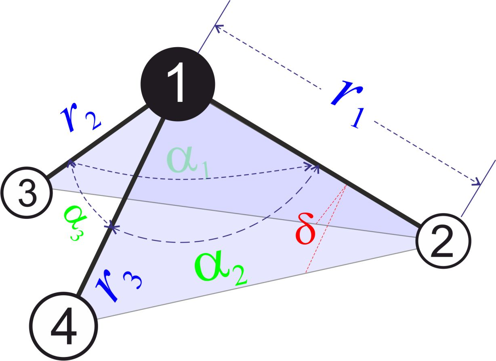
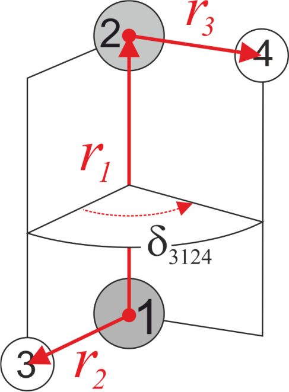
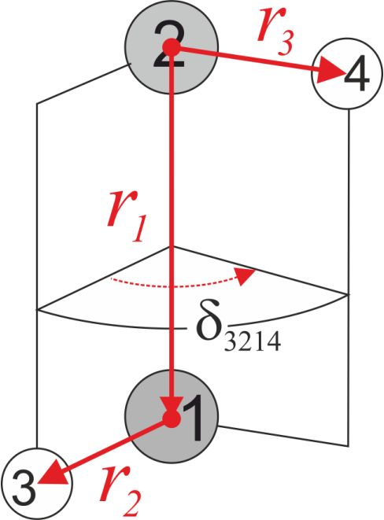
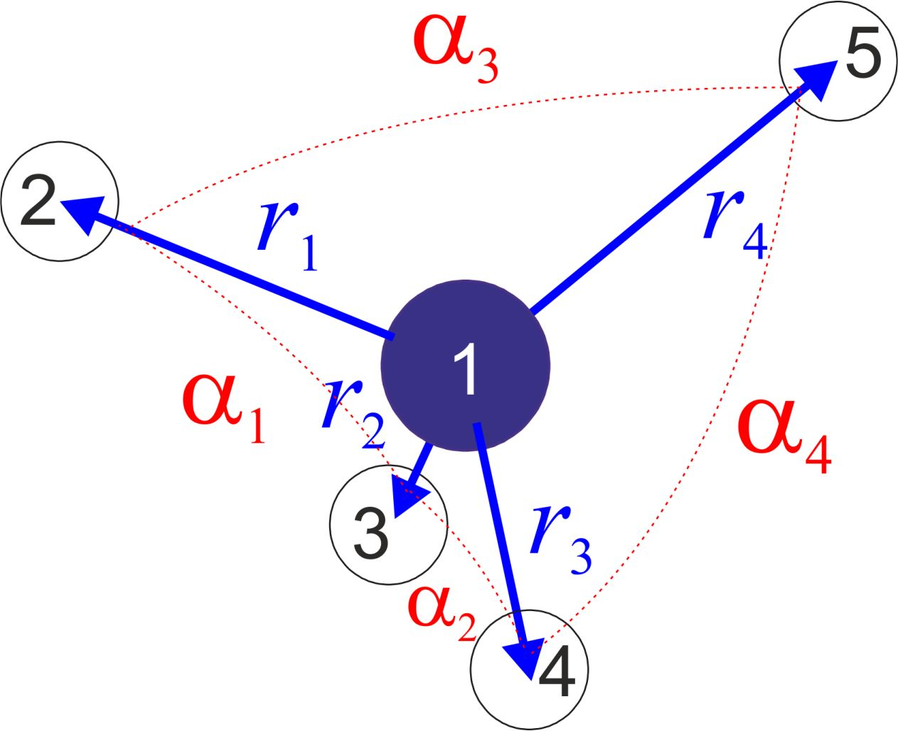

========
Z-matrix
========

TROVE uses the standard Z-matrix scheme to define the molecular structure and introduce the basic internal coordinates, which are Z-matrix coordinates in TROVE. For, example, the hydrogen peroxide HOOH coordinate system is defined using the following Z-matrix defined with the ``ZMAT`` card:
::

   ZMAT
       O1  0  0  0  0  15.99491463
       O2  1  0  0  0  15.99491463
       H1  1  2  0  0   1.00782505
       H2  2  1  3  2   1.00782505
   end

.. note: Zmatrix is also used to introduce the atomic (or nuclear) masses.

Here, the Zmatrix coordinates are as follows.

.. sidebar::

   .. figure:: img/HOOH_zmat.jpg
       :alt: HOOH

       Valence coordinates used for HOOH with a dihedtral angle of type 2.

- Three valence bond length (stretching) coordinates 1,2,3:

.. math::

      \begin{split}
       \xi_1 &= {\bf r}_{{\rm O}_1{\rm O}_2} \equiv {\bf r}_{12} \\
       \xi_2 &= r_{{\rm O}_1{\rm H}_1} \equiv {\bf r}_{13} \\
       \xi_3 &= r_{{\rm O}_2{\rm H}_2}\equiv{\bf r}_{24}
     \end{split}

- Two valence bond-angle (bending) coordinates 4,5:

.. math::

      \begin{split}
       \xi_4 &= \alpha_{{\rm H}_1{\rm O}_1 {\rm O}_2} \equiv \alpha_{312} \\
       \xi_5 &= \alpha_{{\rm H}_2{\rm O}_2 {\rm O}_3} \equiv \alpha_{124}
      \end{split}

- One dihedral coordinate  defined as a book angle :math:`\delta_{3124}` between planes :math:`{\rm H}_1{\rm O}_1 {\rm O}_2` and {\rm H}_2{\rm O}_2 {\rm O}_3:

.. math::

   \xi_6 = \delta_{{\rm H}_1{\rm O}_1 {\rm O}_2 {\rm H}_2} = \equiv \delta_{3124},  
   
which is defined as follows

.. math::
     
        \delta_{ijkl} =  \arccos\left(\frac{[\vec{r}_{ij} \times \vec{r}_{jk}]\cdot[\vec{r}_{jk} \times \vec{r}_{kl}] }{|[\vec{r}_{ij} \times \vec{r}_{jk}]| | [\vec{r}_{jk} \times \vec{r}_{kl}]|}\right).

.. note: The order of the coordinates in TROVE is always: stretching, bending and dihedrals.

Structure of the Zmatrix block
------------------------------

Let us consider the HOOH example above to describe the columns in the ``ZMAT`` block:

+------+---------+-------------+---------------+--------------+----------+------------+
| col  |      1  |   2         |     3         |       4      |    5     |       6    |
+------+---------+-------------+---------------+--------------+----------+------------+
| row  |  atom   | connector 1 | connector  2  | connector  3 |  Type    | Mass       |
+------+---------+-------------+---------------+--------------+----------+------------+
|  1   |      O1 |    0        |       0       |       0      |    0     | 15.99491463|
+------+---------+-------------+---------------+--------------+----------+------------+
|  2   |      O2 |    1        |       0       |       0      |    0     | 15.99491463|
+------+---------+-------------+---------------+--------------+----------+------------+
|  3   |      H1 |    1        |       2       |       0      |    0     |  1.00782505|
+------+---------+-------------+---------------+--------------+----------+------------+
|  4   |      H2 |    2        |       1       |       3      |    2     |  1.00782505|
+------+---------+-------------+---------------+--------------+----------+------------+

Here:

- Col 1 (atom): A label for the name of the atom; it is not interpreted by the program and is currently only for clarity.
- Col 2 (connector 1): The 1st connecting atom to form a molecular bond.
- Col 3 (connector 2): The 2nd connecting atom to form a bond angle.
- Col 4 (connector 1): The 3rd connecting atom to form a dihedral angle or other type angle, depending on the value in column Type.
- Col 5 (Type): A "Dihedral" angle type (see below).
- Col 6 (Mass): The mass of the particle; usually an atomic but sometimes a nuclear mass.

"Dihedral" types
----------------

The following "Dihedral" types are available:

- Type 0: the "Dihedral"  angle  is defined as  a valence angle between bonds :math:`\vec{r_{2}}`  and  :math:`\vec{r_{3}}` as shown in the figure. 

.. sidebar::
    :height: 200 px
     .. figure:: img/XY3_zmat_0.jpg
       :alt: XY3 Zmat
         
       Z-matrix coordinates with a dihedral angle of type 0 used for rigid molecules like PH\ :sub:`3`.

- Type 1: it is defined as  a usual dihedral angle  between two planes (4-1-2 and 3-1-2),  with important addition. One more bond angle :math:`\alpha_3` is introduced (see the figure and also Ammonia example in  `Molecules <https://spectrove.readthedocs.io/en/latest/molecules.html>`__).

       
       Z-matrix coordinates with a "dihedral" angle of type 1 used for NH\ :sub:`3`.

- Type 2: it is the standard dihedral angle as in the HOOH example above. 

       
       Z-matrix coordinates with a dihedral angle of type 2 used for HOOH as in the example above.

        

- Type 202: it is the same dihedral angle :math:`\delta` as type 2, with the difference that the 1st derivative of :math:`\delta`  wrt the Cartesian coordinates (required for the KEO construction) are evaluated using the finite differences, while for types 0, 1, 2, -2, 3-100 the 1st derivatives are evaluates using an analytic expression. Finite difference offer more stable evaluation at positions where the phases of the angles change (0, :math:`\pi`, :math:`2\pi`) which makes their definition ambiguous. 

- Type -2: it is the standard dihedral angle, but with the "backbone" vector inverted, see figure. 

        
       Z-matrix coordinates with a "dihedral" angle of type -2 used for HOOH with the "backbone" vector inverted.

- Type -202: same as type, but the 1st derivative of :math:`\delta`  wrt the Cartesian coordinates  evaluated using the finite differences. 

- Type 402: it is the same as type 202, but with :math:`\delta` defined in the extended range from 0 to 720. This type is useful for the systems with the extended molecular symmetries, such as non-rigid HOOH [15AlOvYu]_  or C\ :sub:`2`\ H\ :sub:`6` [19MeYuMa]_. 

- Type -402: it is the same as type -202, but with :math:`\delta` defined in the extended range from 0 to 720.

- Type 3-100: any number :math:`N` between 3 and 100 means that instead of a dihedral angle, another bond angle is introduced; the "type" card is treated as an additional connector in order to define the bond angle. As example, the following Z-matrix (see the figure) uses a dihedral angle free definition of the vibrational coordinates of CH\ :sub:`4`:
::
    
    ZMAT
        C   0  0  0  0  12.000000000
        H   1  0  0  0   1.007825035
        H   1  2  0  0   1.007825035
        H   1  2  3  0   1.007825035
        H   1  2  3  4   1.007825035
    end
    
    

       Z-matrix coordinates with a "dihedral"type angle of type 4 used for CH\ :sub:`4`, used to define an extra bond angle :math:`\alpha_4`.

